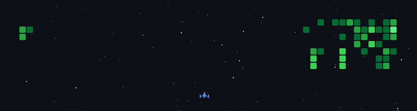

<h1 align="center"><samp>Hey  I'm Dulnith Liyanage</samp></h1>
<h3 align="center"><samp>ENTC Undergrad @ University of Moratuwa</samp></h3>

  

  

## <samp>👨‍💻 About Me</samp>

- <samp>🎓 Electronics & Telecommunication Engineering undergrad at the **University of Moratuwa**</samp>
- <samp>🔭 Currently working on [Smart Trash Sorting System](https://github.com/dulnith-liyanage/EcoSort_Smart_Bin)</samp>
- <samp>🤖 Trying to understand **machine learning, deep learning & AI agents** from the math up</samp>
- <samp>🌱 SWE Intern at [BuildStart](https://buildstart.io/)</samp>
- <samp>⚡ Fun fact: I'd rather derive it than memorize it</samp>

 

  &nbsp;&nbsp;
  &nbsp;&nbsp;
  &nbsp;&nbsp;
   
  &nbsp;&nbsp;
  &nbsp;&nbsp;
  &nbsp;&nbsp;
   
  &nbsp;&nbsp;
  &nbsp;&nbsp;
  &nbsp;&nbsp;
  &nbsp;&nbsp;
  &nbsp;&nbsp;
   
  &nbsp;&nbsp;
  &nbsp;&nbsp;
  &nbsp;&nbsp;
  &nbsp;&nbsp;
  

 

## <samp>🚀 Contribution Graph</samp>

  

  

